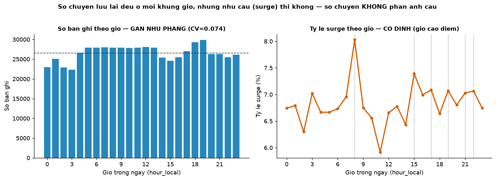

# Báo cáo Nghiên cứu Định giá Đối thủ — Phân tích & Model

**Dự án:** Competitor Fare Forecasting (GSM) · **Người thực hiện:** Nguyễn Đức Hiếu (S.AI.20K)
**Ngày:** 24/07/2026 · **Dữ liệu:** Uber & Lyft Boston (Kaggle) — 637.322 chuyến, 25/11–18/12/2018

> Báo cáo gồm hai phần: **Phần A** — phân tích quan hệ giữa các key feature với giá & hệ số nhân
> (cấu phần i); **Phần B** — model sample dự báo giá & hệ số nhân đối thủ (cấu phần ii).

---

# PHẦN A — Phân tích Relation: Feature ↔ Giá & Hệ số nhân

**Motivation:** Trước khi build model dự đoán giá đối thủ (mục ii), cần biết **feature nào thực
sự quyết định giá và hệ số nhân**. Giả thuyết ban đầu — *giờ cao điểm đắt hơn · trung tâm đắt
hơn · thời tiết xấu đẩy giá lên* — khi đo tương quan trực tiếp đều cho **|r| < 0,05**, gần như
bằng không. Mâu thuẫn với trực giác này đặt ra câu hỏi: *các yếu tố này thật sự không ảnh
hưởng, hay cách đo đang sai?*

> **Required distinction.** Giá thô bị **`loại xe × quãng đường` chi phối 70–76%**. Mọi so sánh
> giá theo khu/giờ/thời tiết **phải kiểm soát hai yếu tố này trước** — nếu không chỉ đang đo *cơ
> cấu chuyến đi*, không phải ảnh hưởng của yếu tố cần xét. (Bằng chứng: giá TB của khu tương
> quan **r = 0,986** với quãng đường TB của khu → chênh giá giữa khu gần như hoàn toàn do độ
> dài chuyến.)

**Contribution:** Tuần này tập trung trả lời câu hỏi **"What features determine price?"** bằng
phân tích quan hệ feature ↔ giá/hệ số nhân trên bộ dữ liệu, dùng **6 phương pháp có kiểm soát**
để không tin một chỉ số đơn lẻ. Từ đó rút ra bộ feature cho model mục ii, đồng thời phát hiện
một số **nhược điểm cấu trúc của dataset** chặn trần model — phần cần trao đổi để xin bổ sung data.

---

### 0. Bối cảnh & phạm vi tuần 1

Dự án gồm ba mục:

| Mục | Nội dung |
|---|---|
| **i** | **Study relation** — các key feature (thời tiết, thời gian, vị trí…) ảnh hưởng thế nào tới **giá** và **hệ số nhân** |
| ii | Build model dự đoán **giá + hệ số nhân**, cho **quan sát trễ** của giá đối thủ + ngữ cảnh |
| iii | **Uncertainty quantification** — xuất kèm khoảng dự đoán, vd *80% PI: [17,20 · 20,60]* |

**Phân công:** Nguyễn Đức Hiếu (S.AI.20K) **focus hơn vào mục ii** — build model forecast
competitor price (Chiến support). Vì vậy ở mục i, hướng phân tích của em **tập trung trả lời
"What features determine price?"** để phục vụ trực tiếp cho việc chọn feature ở mục ii.

> **Nhiệm vụ tuần 1:** hoàn thành **data analysis cho mục i**, và nếu kịp thời gian thì build
> thử một model đơn giản cho mục ii để kiểm chứng hướng đi.

---

### 1. Phân tích relation của các key feature với giá & hệ số nhân (trên bộ dữ liệu)

#### 1.1 Hướng tiếp cận

Câu hỏi trọng tâm: **feature nào quyết định giá** (và phụ: yếu tố nào quyết định hệ số nhân).
Vấn đề gặp ngay từ đầu: đo tương quan thô cho kết quả sai lệch vì **giá bị `loại xe × quãng
đường` chi phối 70–76%** — mọi yếu tố ngữ cảnh (khu, giờ, thời tiết) đều bị hai biến này lấn át.
Do đó hướng tiếp cận là:

1. **Kiểm soát `quãng đường × loại xe` trước**, rồi mới đo phần biến động còn lại thuộc về yếu
   tố cần xét (nếu không, chỉ đang đo *cơ cấu chuyến đi* chứ không phải ảnh hưởng thật).
2. **Tách riêng Uber và Lyft** — hai công thức giá khác nhau (đơn giá/dặm chênh tới 11,5%; danh
   mục dịch vụ không trùng), gộp chung sẽ làm nhiễu kết luận.
3. **Đối chiếu chéo nhiều phương pháp**, không kết luận dựa trên một chỉ số.

#### 1.2 Phương pháp thực hiện

| Phương pháp | Ý nghĩa (đo được gì) | Điểm mù cần lưu ý |
|---|---|---|
| Pearson / Spearman | Quan hệ tuyến tính / đơn điệu | Mù với quan hệ răng cưa (như giờ trong ngày) |
| Mutual Information | Quan hệ phi tuyến bất kỳ | Không cho biết chiều tác động |
| **Correlation ratio (η)** | Sức mạnh giải thích của **biến phân loại** (khu, giờ, thời tiết) | Bị thổi phồng nếu quá nhiều nhóm |
| Permutation importance | Feature mà **model thực sự** dùng | Bị chia phiếu khi feature trùng lặp |
| SHAP | Đóng góp từng dòng, có chiều | Chậm; lệch khi feature tương quan |
| **Hồi quy có kiểm soát** | **Hiệu ứng thuần** của từng yếu tố, tính bằng % sau khi trừ các yếu tố khác | Giả định dạng hàm |

> **Ý nghĩa của cách phối hợp:** dùng η + hồi quy kiểm soát làm *xương sống* (vì phần lớn
> feature là phân loại và quan hệ phi tuyến), rồi lấy các phương pháp còn lại để **kiểm chứng
> chéo**. Ví dụ `moonPhase` xếp hạng cao ở cả MI lẫn permutation nhưng vẫn là rác — chỉ lộ ra
> khi kiểm tra "proxy ngày" (1 giá trị/ngày). Không phương pháp đơn lẻ nào bắt được điều này.

---

### 2. Phân tích từng key feature với giá & hệ số nhân (trên bộ dữ liệu)

Ba nhóm feature ngữ cảnh được phân tích theo cùng một mạch: **cách phân tích → kết luận ảnh
hưởng tới giá và tới hệ số nhân → giải thích vì sao trong bộ dữ liệu yếu tố này lại ảnh hưởng
như vậy**. Nhắc lại: giá đo trên từng chuyến (đã kiểm soát quãng đường); hệ số nhân đo trên Lyft
ở cấp thị trường.

#### 2.1 🕐 Thời gian (time)

**Cách phân tích.** Xem giá TB và tỷ lệ surge theo `hour_local` (0–23), theo thứ / cuối tuần;
kiểm tra dạng quan hệ (đơn điệu hay răng cưa); tách hai chiều *tần suất* (bao nhiêu % chuyến bị
surge) vs *cường độ* (khi surge thì mạnh bao nhiêu). Trực quan bằng biểu đồ quãng đường → giá tô
màu theo giờ (nếu giờ ảnh hưởng, chấm giờ cao điểm phải nằm cao hơn ở cùng quãng đường).

**Kết luận ảnh hưởng.**
- **→ Giá:** ảnh hưởng **rất yếu** — sau kiểm soát, biên độ giá theo giờ chỉ **0,58 điểm %**;
  trên biểu đồ quãng đường→giá, màu (giờ) trộn đều theo chiều dọc → giờ gần như không nâng/hạ giá.
  Giả thuyết "giờ cao điểm làm giá tăng" **bị bác bỏ với giá** trên bộ này.
- **→ Hệ số nhân:** ảnh hưởng **yếu nhưng có thật**, chỉ lên *thời điểm* xảy ra surge — tỷ lệ
  surge dao động **5,91% → 8,03% (1,36×)**, giờ cao điểm 8, 15, 17, 19, 21, 22; nhưng giờ **không**
  làm surge mạnh hơn (cường độ chỉ 1,04×).

**Vì sao trong bộ dữ liệu thời gian lại ảnh hưởng yếu như vậy?** Vì **số chuyến xe được lưu lại
ở các khung giờ gần như bằng nhau, ở mọi khu vực** → phân phối chuyến theo giờ **không phản ánh
được nhu cầu tại giờ cao điểm**. Bằng chứng:

| Phép đo | Giá trị | Ý nghĩa |
|---|---|---|
| CV số bản ghi theo giờ | **0,074** | Số chuyến gần như bằng nhau ở mọi khung giờ |
| CV số bản ghi theo (khu × giờ) | **0,081** | Trong từng khu, các giờ cũng đồng đều |
| Corr(số chuyến, tỷ lệ surge) | **0,015** | Số chuyến gần như độc lập với áp lực cầu |

Nguyên nhân gốc: dữ liệu là **lịch crawl API cố định** (thu giá đều đặn), không phải log đặt xe
thật — số bản ghi phản ánh *tần suất thu thập*, không phản ánh *có bao nhiêu người muốn đi*. Do
đó "giờ cao điểm" (vốn thể hiện qua lượng cầu tăng vọt) **không có cách nào hiện ra trong giá**.



*Hình 1 — Trái: số bản ghi theo giờ gần như phẳng (CV=0,074). Phải: tỷ lệ surge theo giờ lại có
đỉnh rõ (giờ cao điểm). Hai đường không khớp nhau → số chuyến trong dataset không đo được nhu cầu.*

#### 2.2 📍 Vị trí (location)

**Cách phân tích.** Xếp hạng 12 khu theo giá TB; vẽ chân dung từng khu (quãng đường × giá, tách
Uber/Lyft); so **premium thật** sau khi kiểm soát quãng đường; đo η của khu với tỷ lệ surge và
tách hai chiều tần suất vs cường độ theo khu.

**Kết luận ảnh hưởng.**
- **→ Giá:** ảnh hưởng **yếu và gián tiếp** — xếp hạng giá thô cho Boston University đắt nhất
  (18,86 USD), Haymarket Square rẻ nhất (13,58 USD), nhưng **giá TB của khu tương quan r = 0,986
  với quãng đường TB của khu** → chênh gần như hoàn toàn do độ dài chuyến. Sau kiểm soát, biên độ
  chênh thật giữa 12 khu chỉ còn **~15 điểm %**.
- **→ Hệ số nhân:** **mạnh nhất** trong các feature (η = 0,152) — chênh **7,4×** giữa Back Bay
  (11,19%) và North End (1,52%); tần suất & cường độ đi cùng nhau theo khu (r = 0,954). Đáng chú
  ý: **trung tâm không hề surge nhiều hơn** (5,73%) so với khu ngoại vi/đại học (10,10%).

**Vì sao trong bộ dữ liệu vị trí ảnh hưởng ít tới giá nhưng nhiều tới surge?** Vì **vùng thu thập
quá hẹp** — 12 khu đều nằm trong lõi trung tâm Boston (bao lồi **6,7 km²**, bán kính ~5 km, đều
là khu mật độ cao). Khi mọi điểm đón đều "cùng một kiểu" trung tâm, **cơ cấu giá giữa chúng gần
như đồng nhất** → ảnh hưởng của vị trí lên *giá* bị nén xuống chỉ còn 14–17% (và phần lớn là do
quãng đường). Nhưng với *surge*, mỗi khu vẫn có mức khan hiếm xe nội tại khác nhau (Back Bay đông
đúc vs North End yên tĩnh) → vị trí vẫn là tín hiệu mạnh nhất. Kết luận về giá vì thế **chỉ đúng
với phạm vi nội đô hẹp này**, không mở rộng cho sân bay / liên quận xa / ngoại ô.

#### 2.3 🌦️ Thời tiết (weather)

**Cách phân tích.** Gộp các kiểu thời tiết theo `short_summary` (Clear, Rain, Foggy, Drizzle…);
so giá TB (trong cùng dải quãng đường) và tỷ lệ surge giữa các nhóm; **kiểm tra số ngày** mỗi
kiểu thời tiết xuất hiện để đánh giá độ tin cậy.

**Kết luận ảnh hưởng.**
- **→ Giá:** **không đo được ảnh hưởng đáng tin** — biên độ giá giữa 9 kiểu thời tiết chỉ **1,3–1,6%**.
- **→ Hệ số nhân:** tương tự, η chỉ **0,010**, biên độ tỷ lệ surge ~1,25× — không đáng kể.

**Vì sao trong bộ dữ liệu thời tiết gần như không đo được?** Hai lý do:
1. **Thiếu số ngày mưa để tách tín hiệu.** `Drizzle` chỉ xuất hiện **2 ngày**, `Rain`/`Foggy`
   **3 ngày** trong 18 ngày → biến thời tiết **lẫn hoàn toàn với hiệu ứng ngày** (không tách được
   đâu là do mưa, đâu là do đặc điểm riêng của đúng ngày đó).
2. **Thiếu hai mắt xích trung gian.** Ngoài đời thời tiết tác động tới giá qua *(a)* cung–cầu
   (mưa → cung < cầu → surge ↑) và *(b)* thời lượng (mưa → tắc đường → thời gian ↑ → cước ↑). Bộ
   Boston **không có** cả tín hiệu cung–cầu lẫn cột thời lượng, nên hai đường ảnh hưởng này bị đứt.

> ⚠️ Đây **không** phải bằng chứng "thời tiết vô hại". Trên dữ liệu GSM (khí hậu Việt Nam, mùa
> mưa rõ, có đủ cung–cầu & thời lượng), ảnh hưởng của thời tiết **phải được đánh giá lại**.

---

### 3. Tổng hợp: feature nào quyết định giá, feature nào quyết định hệ số nhân

#### 3.1 Kết quả phân tích — feature nào quyết định GIÁ

Thước đo: **% phổ giá mà mỗi yếu tố giải thích được, sau khi đã kiểm soát quãng đường**.

| Nhóm yếu tố | → GIÁ (% phổ giá, sau kiểm soát) | Diễn giải trên bộ dữ liệu hiện tại |
|---|---|---|
| 🚗 **Loại xe (`name`)** | **70–76%** | Yếu tố quyết định áp đảo — bậc giá của hạng xe |
| 📏 **Quãng đường (`distance`)** | *(kiểm soát nền)* | Cùng `name` đã cho R² 0,90–0,95; là trục giá cơ sở |
| 📍 Khu vực đón (`source`) | 14–17% | Sau kiểm soát chỉ còn ~15 điểm % chênh thật giữa 12 khu |
| 📍 Điểm đến (`destination`) | 12–16% | Tương tự khu đón |
| 🕐 Giờ (`hour_local`) | ~5% (biên độ **0,58 điểm %**) | Ảnh hưởng tới giá **rất yếu** |
| 🌦️ Thời tiết | ~5% | Biên độ 1,3–1,6%; còn lẫn với hiệu ứng ngày |
| 📅 Thứ / cuối tuần | ~3% | Không đáng kể |

**Kết quả:** trên bộ dữ liệu này, **giá gần như được quyết định hoàn toàn bởi thuộc tính chuyến
đi (loại xe + quãng đường)**. Các yếu tố ngữ cảnh (khu vực, giờ, thời tiết) đóng góp rất ít vào
giá — khác hẳn các giả thiết ban đầu là các key feature (giờ cao điểm, vị trí, thời tiết) sẽ có
tác động vào sự thay đổi về giá của các cuốc xe.

#### 3.2 Kết quả phụ — feature nào quyết định HỆ SỐ NHÂN

(Chỉ đo được trên Lyft; Uber toàn bộ `surge=1.0`.) Thước đo: η trên bảng cấp thị trường.

| Nhóm yếu tố | → HỆ SỐ NHÂN (η) | Diễn giải |
|---|---|---|
| 📍 **Khu vực đón** | **0,152** ⭐ | Mạnh nhất — chênh **7,4×** giữa Back Bay (11,19%) và North End (1,52%) tỷ lệ surge |
| 📍 Điểm đến | 0,019 | Yếu |
| 🕐 Giờ | 0,011 | Tác động lên *tần suất* surge (1,28×) nhưng không lên *cường độ* (1,04×) |
| 🌦️ Thời tiết | 0,010 | Không đo được đáng tin (lẫn hiệu ứng ngày) |

**Đọc kết quả:** hệ số nhân do **bối cảnh thị trường (vị trí)** quyết định là chính, nhưng
**không dai dẳng** (giờ trước có surge chỉ làm tăng 1,27× khả năng giờ này surge) — trái ngược
với giá vốn rất dai dẳng (r=0,903). Đây là tín hiệu sớm cho thấy hệ số nhân **khó dự đoán** bằng
lag, cần tín hiệu cung–cầu thời gian thực (làm rõ ở mục ii/iii).

#### 3.3 Chốt lại

> **Giá và hệ số nhân do hai nhóm yếu tố khác nhau quyết định:** giá ← *thuộc tính chuyến đi*
> (loại xe + quãng đường); hệ số nhân ← *bối cảnh thị trường* (vị trí). → **Phải tách thành hai
> model, hai bộ feature** cho mục ii.


---

# PHẦN B — Model Sample: Dự báo Giá & Hệ số nhân

**Tóm tắt:** Đã build model sample dự báo giá đối thủ theo hướng **nowcasting với quan sát trễ**.
Model giá **vượt baseline persistence 29–35% MAE**, sai số thật **~1,1 USD (Uber)** và
**~1,5 USD (Lyft)** mỗi chuyến. Model hệ số nhân có tín hiệu phân loại (ROC-AUC 0,65) nhưng điểm
forecast chạm trần do dữ liệu thiếu tín hiệu cung–cầu. Trần độ chính xác của giá là **sàn nhiễu
~2 USD** do dataset thiếu cột thời lượng chuyến đi. → Đề xuất mentor bổ sung 4 nhóm trường dữ liệu.

---

### 1. Kiến trúc model sử dụng

#### 1.1 Ba model độc lập

| Model | Loại | Thuật toán | Target |
|---|---|---|---|
| **Giá Uber** | Regression | `HistGradientBoostingRegressor` | `target_price` |
| **Giá Lyft** | Regression | `HistGradientBoostingRegressor` | `target_price` |
| **Hệ số nhân Lyft** | 2 tầng | Classifier + Regressor | `target_surge` |

**Vì sao 3 model:** giá tách theo hãng (Uber/Lyft khác công thức giá, đơn giá/dặm chênh tới
11,5%); hệ số nhân chỉ có ở Lyft (Uber toàn bộ `surge = 1.0`). → 2 model giá + 1 model surge.

#### 1.2 Thuật toán: Gradient Boosting Decision Trees (HistGradientBoosting)

Model xây **cây quyết định tuần tự** — mỗi cây sửa lỗi (residual) của các cây trước.

**Vì sao chọn (không dùng neural network):**
- Dữ liệu **dạng bảng** → gradient boosting thường thắng neural network.
- Xử lý **categorical + NaN native** (không cần one-hot), tự học tương tác `distance × name`.
- **Giải thích được** (permutation importance) — hợp yêu cầu interpretability.
- Train nhanh trên CPU.

#### 1.3 Model hệ số nhân — kiến trúc 2 tầng (hurdle model)

Không hồi quy thẳng (86% giá trị = 1.0 → hồi quy thẳng thua cả hằng số). Tách:

```
Tầng 1 (phân loại):  P(có surge | X)         → HistGB Classifier
Tầng 2 (hồi quy):    E[độ lớn | có surge]    → HistGB Regressor (train trên nhóm có surge)
Kết hợp:  E[hệ số nhân] = P(surge)·E[độ lớn] + (1 − P(surge))·1.0
```

---

### 2. Phân chia dữ liệu huấn luyện

Chia **theo THỜI GIAN**, tuyệt đối không chia ngẫu nhiên (bài toán dự báo — chia random sẽ để
model "nhìn thấy tương lai" → kết quả đẹp giả).

| Tập | Khoảng thời gian | Số dòng (bảng giá) | Dùng để |
|---|---|---|---|
| **train** | 25/11 → 10/12 | 289.271 | Huấn luyện model |
| *(buffer)* | 11–12/12 | *(loại)* | Ngăn train dính sát calibration |
| **calibration** | 13/12 → 15/12 | 97.697 | Dành cho cấu phần (iii) — Conformal Prediction |
| **test** | 16/12 → 18/12 | 84.681 | Đánh giá cuối, model **chưa từng thấy** |

**Chống rò rỉ (đã kiểm chứng):**
- Mọi feature chỉ dùng lag từ **quá khứ** (`shift(k≥1)`); tuyệt đối không dùng giá/surge tại t.
- Kiểm `lag1 == shift(1)` **trong từng split** → khớp 100% (train/calib/test).
- Loại các cột tính tại t: `price_min/max/spread`, `quote_count`.

---

### 3. Cấu hình ban đầu

| Tham số | Giá trị | Ý nghĩa |
|---|---|---|
| `max_iter` | 500 | Số cây tối đa (số vòng boosting) |
| `learning_rate` | 0,05 | Mỗi cây đóng góp bao nhiêu (nhỏ = học chậm, chắc) |
| `l2_regularization` | 1,0 | Phạt độ phức tạp → chống overfit |
| `early_stopping` | True | Tự dừng khi validation không cải thiện |
| `validation_fraction` | 0,1 | 10% tập train làm validation nội bộ |
| `categorical_features` | name, source, destination, obs_age_bucket | Xử lý categorical native |
| **log-target** | có | Giá lệch phải → `log` cân đối phân phối, giảm MAE ~5% |

**Đường huấn luyện:** train loss và validation loss giảm dốc trong ~50 cây rồi phẳng, **gần như
trùng khít nhau** → không overfit; phần phẳng = đã chạm sàn nhiễu của dữ liệu.

**Bộ feature:**
- **Giá:** `name`, `distance_median`, `source`, `destination` + `lag1/2/3_price`,
  `roll_mean6_price`, `roll_std3_price`, `observation_age_minutes`, `hour_local`, `weekday_local`, `is_weekend`.
- **Surge:** `source`, `destination`, `short_summary`, `hour_local` + `lag1/2_surge`,
  `roll_mean6_surge`, `roll_surge_rate6`, `observation_age_minutes`.

---

### 4. Kết quả thu được (tập test)

#### 4.1 Model GIÁ — chỉ số tổng hợp

| Hãng | n_test | MAE (USD) | RMSE | R² | MAPE | Bias | vs persistence | vs hist-avg |
|---|---|---|---|---|---|---|---|---|
| **Uber** | 43.767 | **1,088** | 1,810 | **0,955** | 7,37% | −0,09 | **+35,4%** | +17,9% |
| **Lyft** | 40.914 | **1,502** | 2,933 | **0,914** | 9,71% | −0,19 | **+29,3%** | +15,4% |

Baseline: persistence (dùng giá cũ) Uber 1,683 / Lyft 2,125; historical-avg 1,325 / 1,775.
→ Model **vượt cả hai baseline** ở cả hai hãng.

#### 4.2 ⭐ Sai số tiền thật — đây là con số dễ hiểu nhất

> **MAE = số tiền sai trung bình mỗi chuyến.** Model dự đoán giá đối thủ lệch trung bình
> **~1,1 USD (Uber, ~28 nghìn đồng)** và **~1,5 USD (Lyft)** so với giá thật.

**Phân bố sai số tuyệt đối (USD):**

| Hãng | p50 (trung vị) | p75 | p90 | p95 | max |
|---|---|---|---|---|---|
| Uber | 0,73 | 1,32 | 2,27 | 3,18 | 47,29 |
| Lyft | 0,85 | 1,71 | 3,05 | 4,47 | 45,47 |

**Tỷ lệ chuyến dự đoán đúng trong ngưỡng:**

| Hãng | ≤ 0,5 USD | ≤ 1 USD | ≤ 2 USD | ≤ 3 USD | > 5 USD (lệch lớn) |
|---|---|---|---|---|---|
| Uber | 35,6% | 63,9% | 87,4% | 94,3% | 1,9% |
| Lyft | 32,1% | 56,0% | 79,9% | 89,7% | 4,2% |

→ **~50% chuyến sai dưới ~0,85 USD; ~90% sai dưới ~3 USD.** Vài case lệch lớn (~45 USD) là chuyến
giá cao bất thường.

#### 4.3 Suy giảm theo độ trễ — kết quả vận hành

MAE model (USD) theo độ trễ quan sát:

| Độ trễ | Uber | Lyft |
|---|---|---|
| ≤15 phút | 1,096 | 1,527 |
| 15–30 phút | 1,090 | 1,450 |
| 30–60 phút | 1,083 | 1,494 |
| 1–3 giờ | 1,076 | 1,536 |
| >3 giờ | **1,029** | 1,529 |

→ **MAE gần như phẳng** (Uber còn giảm nhẹ) từ 15 phút tới 3 giờ. Model dùng quan sát cũ 3 giờ
vẫn chính xác gần như dùng quan sát 15 phút. **Trả lời câu hỏi kinh doanh: không cần crawl dày
cho giá → tiết kiệm chi phí thu thập.**

#### 4.4 Model HỆ SỐ NHÂN (Lyft) — báo cáo trung thực

| Chỉ số | Model | Baseline | Đánh giá |
|---|---|---|---|
| ROC-AUC | **0,652** | persistence 0,518 | ✅ có tín hiệu phân loại |
| PR-AUC | 0,189 | nền 0,135 | 🟡 nhỉnh hơn nền |
| Brier | 0,113 | — | (cho phần iii) |
| MAE E[mult] | 0,064 | luôn-1.0: 0,040 | ❌ thua hằng số |

**Diễn giải:** khi surge thực cao (1,4–1,5), model thường chỉ đoán ~1,05 → hụt, vì surge hiếm
(13,5%) + **không dai dẳng** + thiếu tín hiệu cung–cầu. Giá trị của model nằm ở **xác suất
P(surge)** (khu Back Bay P cao hơn hẳn Haymarket), không ở con số điểm — đây là **trần thật của
dữ liệu**, không phải model dở.

---

### 5. Kết luận về model hiện tại

**Đạt được:**
- Model giá **vượt KPI** (giảm 29–35% MAE vs persistence, R² 0,91–0,96), vượt cả baseline mạnh
  hơn là historical-average.
- Sai số thật chỉ **~1,1–1,5 USD/chuyến**; ~90% chuyến sai dưới 3 USD.
- **Không suy giảm theo độ trễ** → không cần crawl dày.
- Model **giải thích được**, không overfit (train ≈ validation).

**Giới hạn — là của DỮ LIỆU, không phải model:**
- Giá chạm **sàn nhiễu ~2 USD**: với hai chuyến giống hệt (cùng xe, cùng quãng đường tới 0,01
  dặm, cùng giây), 88,7% vẫn khác giá — do dataset **thiếu cột thời lượng chuyến đi** (giá thật
  có thành phần tính theo phút, vd Grab 350đ/phút). → trần R² ~0,93.
- Model surge point-forecast chạm trần do **thiếu tín hiệu cung–cầu** (số chuyến trong dataset là
  lịch crawl, không phản ánh nhu cầu thật).

> **Điểm mấu chốt:** muốn cải thiện hiệu suất, phải **bổ sung dữ liệu**, không phải chỉnh model.
> Model đã khai thác hết thông tin có trong bộ Boston.

---

### 6. Đề xuất mentor — trường dữ liệu thật để mô phỏng & cải thiện

Không cần data raw — xin theo dạng **phân phối (distribution) để sample** hoặc **simulated data**
theo cấu trúc giá GSM. Bốn nhóm, ưu tiên #1 và #2:

| # | Trường dữ liệu | Giải quyết giới hạn | Lợi ích kỳ vọng |
|---|---|---|---|
| 1 | **Thời lượng chuyến đi** (duration/ETA) — phân phối theo quãng đường × giờ × tình trạng giao thông | Sàn nhiễu ~2 USD (§5) | Nâng trần R² vượt 0,93 |
| 2 | **Tín hiệu cung–cầu** (số tài xế rảnh, số cuốc chờ) — phân phối theo khu × giờ | Model surge chỉ R²≈0,04 | Nếu dự đoán surge tốt: giảm MAE giá thêm ~30% (1,5 → 1,1 USD) |
| 3 | **Log đặt xe thật** (thay lịch crawl cố định) | Số chuyến hiện không phản ánh cầu | Kích hoạt lại nhóm feature thời gian (giờ cao điểm) |
| 4 | **Vùng địa lý rộng hơn** (sân bay/liên quận/ngoại ô) | Vùng thu thập hiện chỉ lõi Boston ~6,7 km² | Kết luận về vị trí khái quát được |

**Cách dùng dữ liệu xin được:** dùng phân phối/simulated data để **bổ sung hai biến trung gian
(thời lượng, cung–cầu)** vào snapshot hiện tại → train lại model → đo mức cải thiện MAE. Đây là
bước mô phỏng để chứng minh giá trị của dữ liệu trước khi triển khai trên hệ thống thật của GSM.

---

### 7. Sản phẩm bàn giao

| File | Nội dung |
|---|---|
| `model/data_preparation.ipynb` | Xử lý dữ liệu → snapshot |
| `model/model_train.ipynb` | Huấn luyện 3 model |
| `model/test_evaluation.ipynb` | Đánh giá chi tiết trên tập test |
| `data/test_ketqua_price_{uber,lyft}.csv` | Dự đoán + sai số từng dòng |
| `data/test_ketqua_surge_lyft.csv` | Dự đoán surge từng dòng |
| `docs/MODEL_DESIGN.md`, `docs/MODEL_RESULTS.md` | Thiết kế & kết quả chi tiết |

